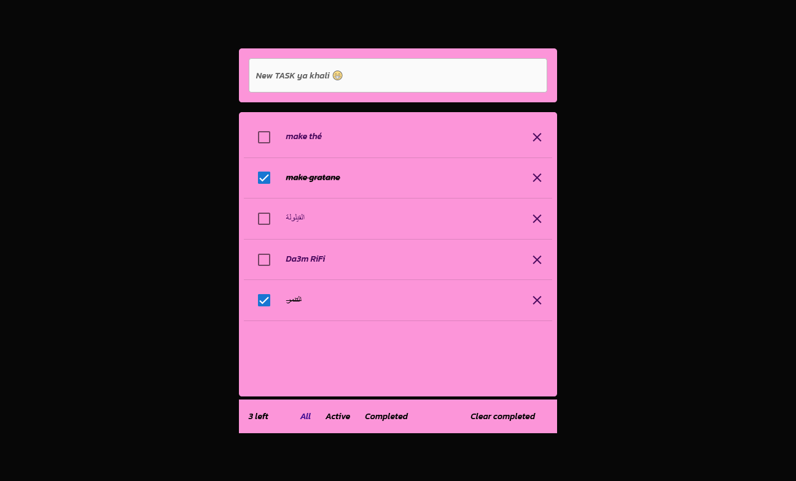

## Run Locally

Clone the project

```bash
  git clone https://github.com/EL-KHAL/todo-list-vite.git
```

Go to the project directory

```bash
  cd TODO-KHALO
```

Install dependencies

```bash
  npm install
```

Start the server

```bash
  npm run dev ya khali
```
